## MULTI-REGION AND MULTI-RESOURCE GOVERNANCE SYSTEM (THE CLOUD JANITOR)

## INTRODUCTION:

This is a fully **Serverless Governance System** designed to reduce AWS operational costs and enforce compliance by automatically managing unused or insecure resources across multiple regions. It acts as an **always-on cloud janitor**, proactively discovering, notifying owners about, and remediating violating or forgotten resources that could incur unnecessary costs or pose security risks.

## Core Value Proposition:

- **Human Control**: Integrates Slack with interactive buttons for flexible human intervention (Snooze).
- **Intelligent Enforcement**: Uses CloudWatch metrics (e.g., CPU/Connections) for resource validation, moving beyond simple tagging.
- **Auditable**: Ensures detailed records of every action and decision are logged for compliance and analysis.

---

## ARCHITECTURE OVERVIEW

This system is built on a robust, event-driven serverless stack, primarily orchestrated by **AWS Step Functions** and **Lambda**.

- **Trigger: Amazon EventBridge** triggers the State Machine daily at 4:00 PM.

- **Orchestration:** The **State Machine** manages the entire lifecycle, ensuring reliable and ordered execution of the stages.

**User Interface: Slack** is integrated via **API Gateway** to provide interactive notifications and manage user exceptions.

**Data & State Management: DynamoDB** is used for logging execution audit, managing resource locks (in-process status), and storing user-requested snoozes (exceptions).

**Scale:** The system is composed of **seven distinct Lambda functions** executing the primary governance stages.

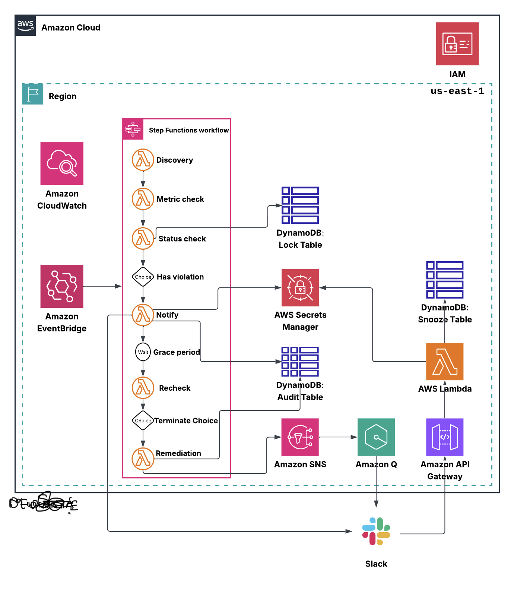

---

## EXECUTION FLOW: THE STAGES

The governance routine is executed by the Step Function across sequential stages, controlled by dedicated Lambda functions and Choice States.

1. **Discovery (Lambda)**

**Function:** Scans the entire AWS environment in every available region to identify resources violating governance policies (e.g., untagged EC2, unattached EIPs, IAM users without MFA).
**Snooze Check:** Crucially checks the **DynamoDB Snooze Table** to bypass any resources already exempted by an owner.
**Output:** Passes potentially violating resources to the next step.

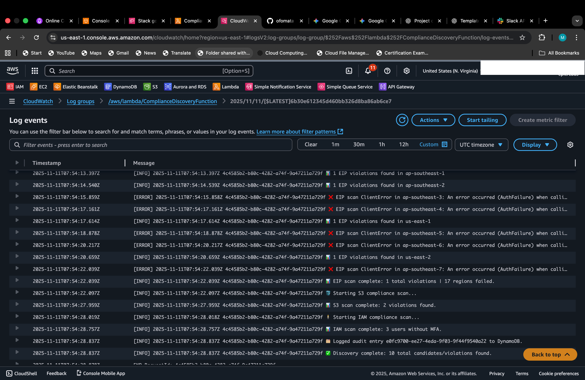

2. **Metric Check (Lambda)**

**Function:** Intelligently assesses the usage of discovered resources using **CloudWatch data**.
**Action:** Runs **CPU Utilization** checks: if an EC2 instance is $\le 5.0\%$ or an RDS instance has $0$ connections, it is marked as idle/unused and passed to the next stage.

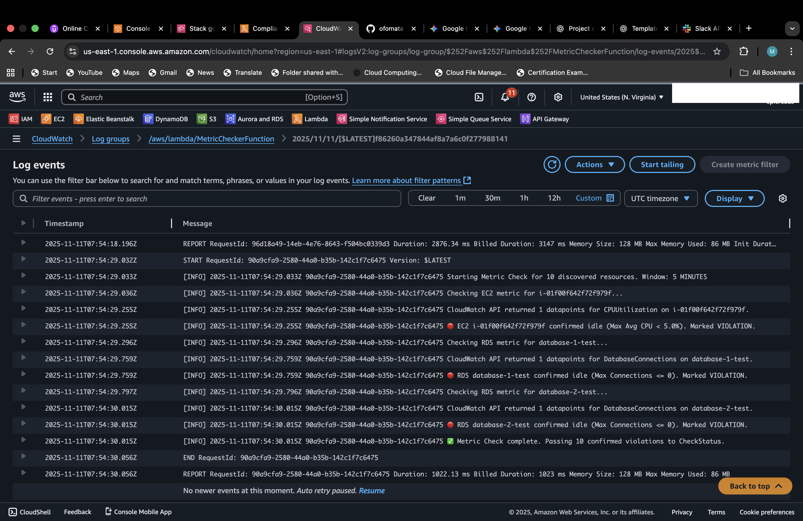

3. **Status Check (Lambda)**

**Function:** Prevents concurrent processing. Implements a **Locking Logic** to ensure the same resource is not processed by multiple concurrent State Machine executions.
- **Lock Acquired:** The resource is new or is re-violating; the process proceeds.
- **Lock Failed:** The resource is currently being processed; the current execution skips it.
**Cleanup:** The separate **DynamoDB Lock Table** uses **TTL** to automatically delete the lock once the execution is complete.

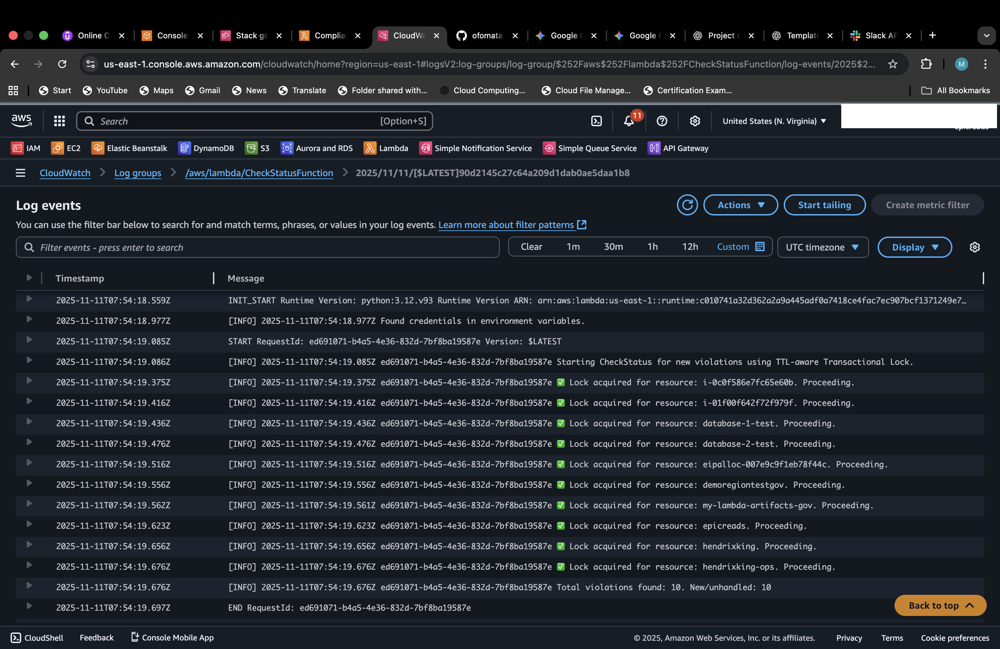
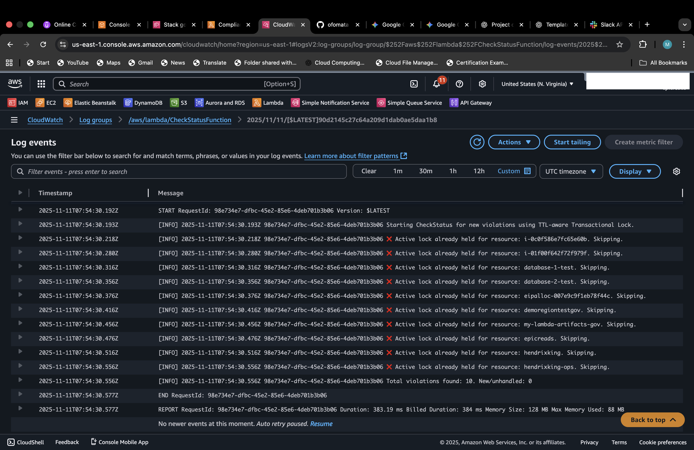

4. **Decision Gate (Choice State)**

**Function:** This is the first conditional gate. It determines the subsequent path based on the results from the Status Check.
**Outcome:** If **no violations** are found, or if all violations are currently **locked** (in process), the workflow immediately jumps to a **Succeed State**. Otherwise, it proceeds to notify.

5. **Notify (Lambda)**

**Function:** Integrates with **Slack** to send a violation notification to the resource owner or team and logs the violation to the Audit Table.
**Interactive Control:** The notification includes an interactive button that calls an **API Gateway** endpoint to trigger a temporary exemption.

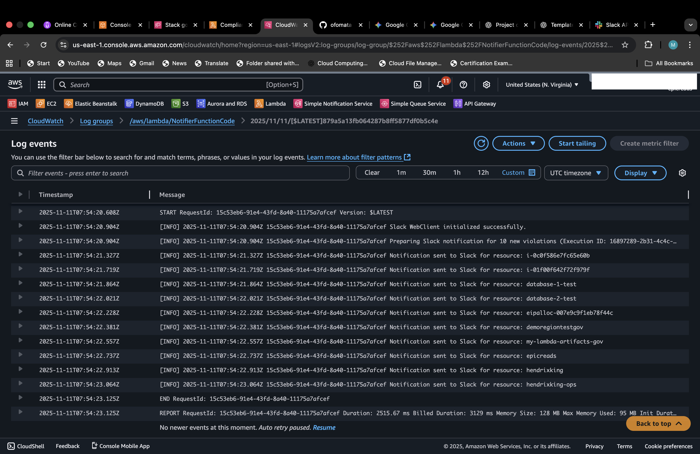

**Snooze Mechanism (Independent Lambda):** If the button is clicked, a separate Lambda (outside the State Machine) is triggered via API Gateway. It stores the resource ID and exemption details in a **DynamoDB Snooze Table** with a configurable **TTL** (e.g., 30 days).


6. **Wait Grace Period (State Machine)**

**Function:** The State Machine enters a mandatory **Wait State**, giving the owner time to resolve the issue or activate the snooze exception.

7. **Recheck (Lambda)**

**Function:** Re-evaluates the reported resources after the wait period. It checks if the owner has manually corrected the violation and checks the Snooze table to confirm if any resource is exempted.

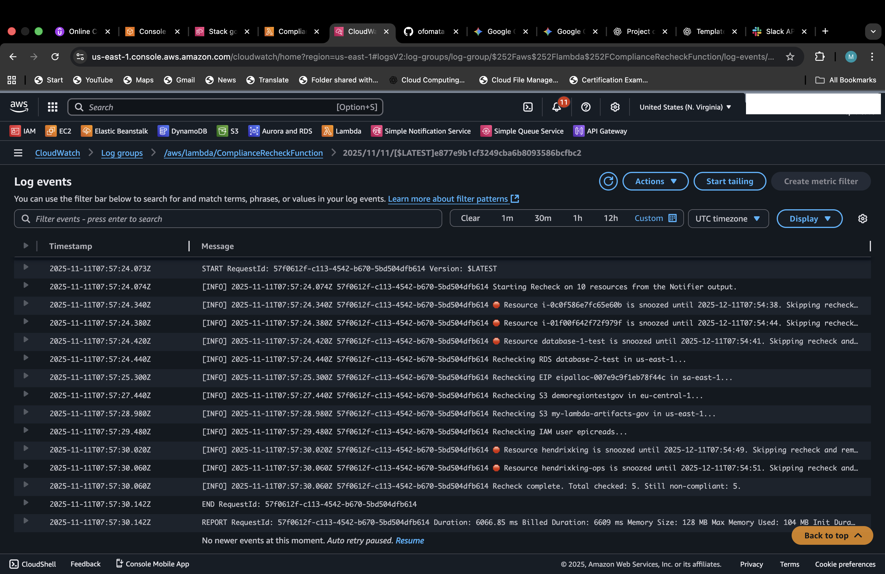

8. **Decision Gate (Choice State)**

**Function:** This is the final checkpoint. It decides whether to remediate or exit.
**Outcome:** If the violations are **cleared** or **snoozed**, the workflow immediately jumps to a **Succeed State**. If violations still exist, the workflow proceeds to Remediation.

9. **Remediation (Lambda)**

**Function:** If resources remain non-compliant, this function performs **auto-remediation** (e.g., deleting RDS, stopping EC2, releasing EIPs, or tagging IAM and blocking S3 public access).
**Final Notification:** A final **non-interactive** remediation notification is sent via a separate **Amazon Q(Chatbot)** configuration to the Slack Channel, confirming cleanup and logging actions to the Audit Table.

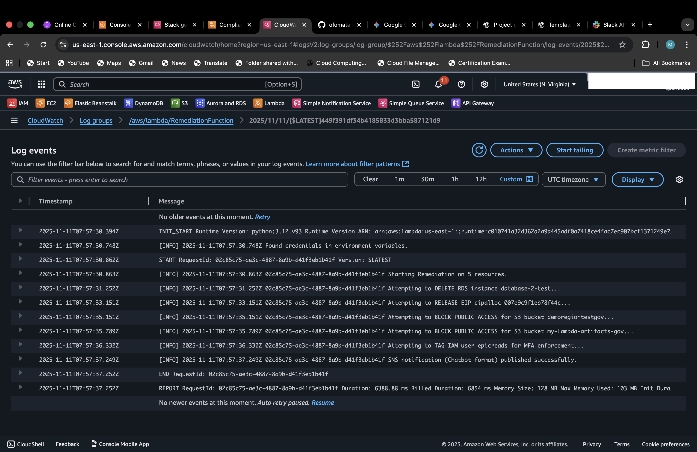

---

## STATE MACHINE STAGES DIAGRAM(GRAPH)

Visualizing the flow is essential for understanding the logic:

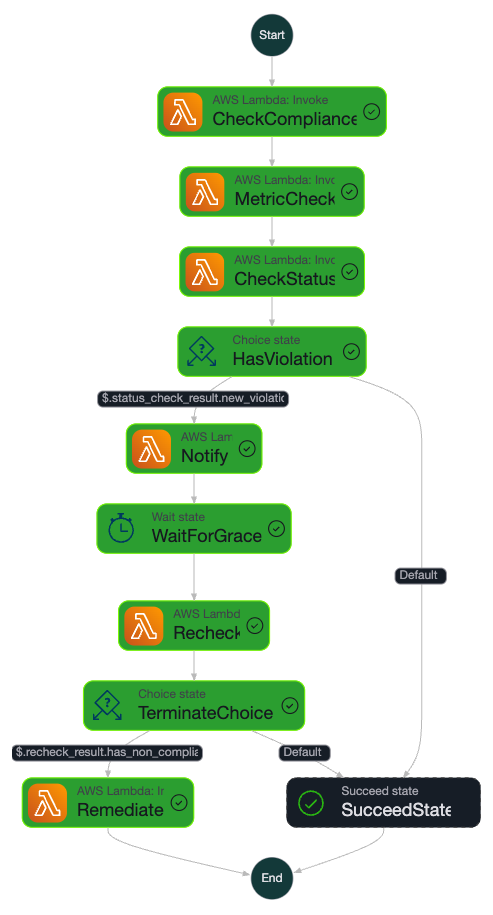

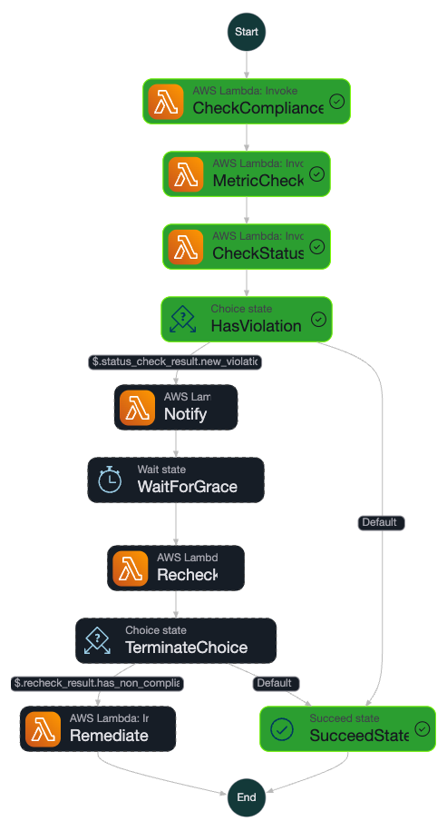

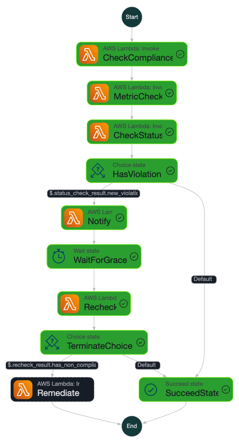

---

## CHALLENGES:

A few challenges faced during the implemenatation of this project ranged from a lot of logical errors and consideration to a few syntax errors.

1. One of the first challenges faced was using only manual tags such as testing or unused to determine which instance or resources was violating. While this worked, it would aslo neglect resources which werent tagged by the user. So this immediately required the introduction of an intelligent system using **metric check** to **query cloudwatch** for **CPU Utilization** of resources.

2. The second challenge was a heavy logical combat. Giving that this system runs daily i needed to ensure the system knows not to concurrently run resources that are already in exection, this is to avoid repeated unnecessary notifications and totally avoiding clashes and errors. This challenge was quickly solved by introducing the **Check Status function** which scanned through the audit table for already existing resource id's and skipping them as (in process), this also enabled the use of **GSI** in the DynamoDB for fast table reading. 

3. While the last solution solved the immediate problem it hence created a new and even bigger one. **"What happens when a resource re-violates?."** Because my previous solution only checks for resource id, this would mean it would totally ignore an old resource re-violation simply because it's resource id already exists in the Audit Table. I tried solving this problem by using the resource's last stage actions (e.g., Remediated, Waiting etc.). While this worked, it wasn't robust enough as the system kept running the same resources concurrently or sometimes even not completing the entire cycle. I decided to introduce a new table here to solve this problem, the **Governance Lock Table** and instead of just checking for resource id or checking last stage actions, the Check Status now attempts to **lock** every single resource it gets to this table which is configured with a **TTL** in order to delete the resources after the execution is complete. This now required the check status function to skip a resource if it fails to acquire a lock for it and proceed with it, if it does acquire a lock.

4. This challenge, while not a heavy disruption taught me that **Amazon Q (formerly AWS Chatbot)** requires **JSON payloads matching its schema to interpret structured messages**. But my lambda was publishing a standard raw text message to SNS, and i was hit with an **"Event received is not supported"** error. This was a quick fix as i just needed to rewrite the lambda function to ensure the SNS publication uses the required JSON structure.

---

## BEHIND THE MULTI-REGION AND MULTI-RESOURCE GOVERNANCE SYSTEM PROJECT

This project started off very easy and straight forward untill the single lambda function i was initially using to run the whole system started getting longer and longer. I knew it was time to step up and separate the function into distinct functions and this was why i went with the **Step Functions**. This project pushed me beyond experiences i wasn't farmiliar with. I didn't have much issues with syntax errors but logical errors made the whole project challanging and a bigger fight than i expected. This project taught me a lot and exposed me to new technologies. I learnt about **Slack** and how to integrate it with AWS and this project is my first use case of Slack and also my first time integrating a non AWS service with AWS with the exception of Github.

This wasn't just a random project, it was a lesson in patience, structure, persistance, logical reasoning and most importantly thinking outside the box. This project is a proof of endurance and success behind every logical error that has no documentation fix.

[Watch the Full Application Functionality Here](https://drive.google.com/file/d/1w-l4KeBtKS9baTDzZn7gMcM9BInkK9aa/view?usp=drivesdk)

---

## TECH STACK

- **AWS Services:** CodePipeline, Cloudformation, SNS, DynamoDB, IAM, Lambda, Step Function, EventBridge, Amazon Q(Chatbot), API Gateway(HTTP API), Cloudwatch, Secrets Manager, S3.

- **Language:** Python

- **Tools:** AWS CLI, Git, Github, Slack

---

## IMPLEMENTATION INSTRUCTIONS

1. **Slack Workspace:** Ensure you have a slack workspace where you have permissions to add apps, Choose or create a specific channel (e.g., #cloud-janitor-alerts) for the notifications.

2. **Connecting Slack to AWS:** 
- Go to the **AWS Chatbot(Amazon Q)** service in the **AWS Console**.
- Click on **"Configure new client"** and select Slack from the dropdown.

**Note** You'll be redirected to Slack's authorization page to request permission for Amazon Q Developer to access your Slack workspace. This installs the AWS Chatbot app into your Slack workspace.

- When this is done take note of the **Slack WorkSpace ID** on the AWS Console. Also go to Slack, right click the channel name and select copy link. This is to get the **Channel ID**. The ID is the last part, starting with C or G

3. The next step is to configure the New Slack Channel in Chatbot, but you will be doing this with a cloud formation template which i have written and saved as `governance.yaml`.

4. When the cloudformation template is uploaded and this resource is created you will need to **invite the Amazon Q** to the slack channel. To do this type `/invite @Amazon Q` in the channel's message box and click send. Only do this after cloudformation has completed resource creation.

**Note** This step is just for notifications remediation will send. The main notification of the violations will be handled by Slack itslef because it has interactive buttons.

5. **Create a Slack App:**
- Go to the slack app page **api.slack.com/apps** and create new app.
- Choose from Scratch.
- Give it a name and select your workspace.
- **Add permissions(Bot Token Scopes):** Go to **OAuth & Permissions**. Under Scopes, Bot Token Scopes, add:
chat: write and chat:write.public if you are posting to public channels.
- **Install the App to Workplace:** Scroll up and click **Install to Workplace**. Authorize it.
- **Copy Bot User OAuth Token and Signing Secret:** The Bot OAuth Token is right above the same page and the signing secret is in basic information page.

**Note** Keep these tokens safe. I recommend storing them in **AWS Secrets Manager** which was what i did in this project. These Tokens will be used in the `notifier.py` and `snooze_handler.py` functions.

- This next step is after the cloudformation template completes resource creation.

6. **Configure Slack App Interactivity:**
- Go to the Slack App configuration page **api.slack.com/apps**
- Go to Interactivity & Shortcuts.
- Toggle Interactivity ON.
- In the Request URL, paste the invoke URL of your API Gateway endpoint **(e.g., https://<api-id>.execute-api.<region>.amazonaws.com/slack/interactivity)**.
- Click Save Changes.

**Crucial Note** You need to package the `notifier.py` and `snooze_handler.py` in a folder that has the **slack sdk** installed and zip the dependencies and the python file inside the folder. This is because Slack isn't an AWS service so AWS doesn't manage the dependencies and sdk for slack. Because these two lambda functions would need the slack sdk, it's adviced to manually install and package.

**See Below how to Install Slack SDK and Dependencies:**

- cd to the project directory first then run

``` bash
mkdir notifier_package
cd notifier_package

pip3 install slack_sdk -t .

#Before you zip make sure your notfier.py is inside this folder too
zip -r notifier_with_slack_sdk.zip .
``` 
- Do the same for `snooze_handler.py` but the only difference is you need to install **requests dependencies** too so change this to 

``` bash
pip3 install requests slack_sdk -t .
```
- And zip.
- Upload these zipped files and all other zipped lambda codes to the S3 Bucket referenced in you cloudformation template.

---

## Crucial Note on Automation

This Project requires a few manual set up and configuration ready that isn't controlled by cloudformation so it's important to take note and follow due proceedures.

**Inivting the Amazon Q app to the slack channel and Configuring Slack App Integration must and can only be done after cloudformation create is complete.**

While:

**Creating Slack Workspace, Connecting Slack to AWS, Creating a Slack App must and should be done before the deployment of the cloudformation stack.** 

You'll only need to do these once anyways except maybe you deleted something. Once all these are done, both the before and after, even as you update your stack, it'll still be fine. Just be mindful of changes like **API Gateway endpoint** but you'll only worry about this if the stack was deleted and recreated.

---

[Full CI/CD Execution Demo](https://drive.google.com/file/d/1RTvDT6nSoHAK-WtwsGosN7bbu_Sn3RJE/view?usp=drivesdk)

---

## UNDERSTANDING THE CLOUDFORMATION TEMPLATE

I have written a cloudformation template to deploy the entire non manual steps of this project. Take a brief look into the resources configured and created in `governance.yaml`.

1. **SNS**: I created an SNS Topic as the point of notification that Amazon Q could subscribe to so as to deliver these notifications to Slack Channel.

2. **DynamoBB**: Three major DynamoDB Tables were used in this project, with all serving distinct and very important roles. The main Tables logs every activity carried out by the governance system and provides these logs when needed for analysis. I configured this particular table with GSI to offer faster and more accurate reading even as the data grows. The two other tables serves as a temporary hold for resources that are in an execution process and for resources that has been snoozed. These two tables are configured with a TTL to only hold resources for only the periods of time required.

3. **IAM**: Every Single step of this project required an IAM Role configuration with least privilledges as all the services and systems used, needed to communicate or access each other. So i set up multiple roles for each services and only gave the required permissions needed to ensure saftey and best practices.

4. **Lambda**: This project uses multiple Lambda Functions to perform different tasks. This is the core of the project as i wanted to rely heavily on using a serverless service for this project.

5. **Step Function**: This is the ochestrator of the entire workflow, i used a step function to divide my initial single heavy lambda function into different functions and the step function is used in this case to orchestrate and control the executions of each of these different functions.

6. **EventBridge**: I configured an Event Rule to be a main trigger for the system. This rule is set to trigger the State Machine every day at a specific time (say, 4PM) in order for the State Machine to carry out a dialy routine check.

7. **Amazon Q(Chatbot)**: The Amazon Q is configured in this project to deliver notifications from SNS to a configured Slack Channel. This service is subscriped to the SNS Topic and is integrated with Slack. This handles the non interactive notifications.

8. **API Gateway(HTTP)**: I configured a HTTP API to server as a trigger to the Snooze Lambda Function. When a snooze button is clicked, slack calls this API, using the API endpoint, and this API triggers the lambda function which carries out the exemption task.

9. **Secret Manager**: While this service wasn't configured in this template for security reasons, the Secret Manager was used to securly store the secret credentials lambda used to perform actions, Including the Bot OAuth Token and the Signing Secret. I made sure only the required function can access this service with a least priviledge role. The ideas was to keep this service and its values isolated.

10. **CloudWatch**: I used Cloudwatch to monitor the entire activity of this project, especially with Lambda, this service was also used as check system for some violating resourses.

---

## TARGETED RESOURCES
So far this project only targets 5 resources in every region avialable:

1. **EC2 Instances** The EC2 Instance is a heavy contributor to cost especially when left unattended. This system targets every running Instances in every region and looks out for Instances tagged as Environment: testing or unused, these resource immediately goes in as a violation. But most importantly this system also used an intelligent metric system to query Instances based on their CPU Utilization, and if an instance is found to be < 5.0, this instance will be tagged as idle and quickly marked as non compliant. The remediation for violating instances is stopping the instances. Stopping instances doesn't necessary stop costing as you still get charged for EBS Volumes but its lesser compared to an idle running instance.

2. **RDS** The Amazon RDS is also a heavy contributor to cost especially when left running. This system targets every running RDS and also uses the metric system to query RDS Instances that has 0 connections and if found, it gets marked as non complaint. The remediation for RDS Instances is deletion.

3. **Elastic IP's** The Elastic IP address doesn't incure cost when attached to an instance but when left unattached this incures additional costs, so this system targets every unattached Elastic IP Address and releases them.

4. **IAM** The IAM is one of the targetted resource in this project, but not for cost utilization but for security and best practice. This system looks out for every single IAM User in an AWS Account and checks if these users has MFA configured and if not it quickly tags the users as non complaint and the remediation is tagging these users with MFA REQUIRED.

5. **S3** The S3 is also another targetted resource for security and best practice. The system querries every S3 in every region to ensure too much permission isn't given like public access either by policy or unchecked public boxes and also ALC configuration and if found as non complaint, this system toggles on the block all public access option.

---
